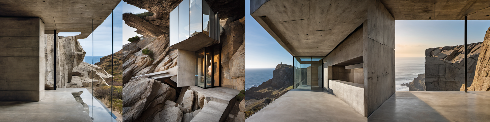
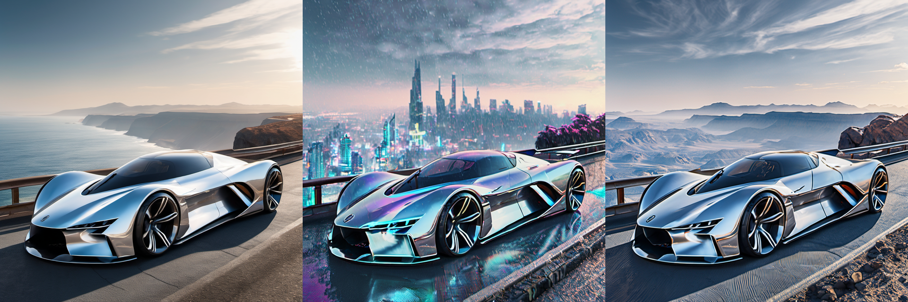
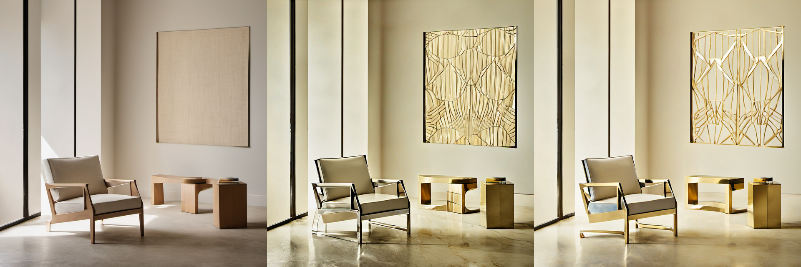

# 🧭 Gimbal — Navigate latent space with precision flight instruments, not lottery prompts.

<p align="center">
  <picture>
    <source media="(prefers-color-scheme: dark)" srcset="brand/lockup-dark.svg">
    <source media="(prefers-color-scheme: light)" srcset="brand/lockup-light.svg">
    
  </picture>
</p>

<p align="center">
  <a href="https://github.com/FormAndNoise"></a>
  <a href="https://github.com/comfyanonymous/ComfyUI"></a>
  <a href="https://python.org"></a>
  <a href="https://pytorch.org"></a>
  <a href="LICENSE"></a>
</p>

---

**Gimbal** (formerly *Wayfinder* / *Latent Explorer*) is an artisan-grade latent space navigation suite for visual generative artists, creative technologists, and AI researchers built on **ComfyUI**.

Generative latent spaces are not lottery slots—they are high-dimensional topological manifolds. **Gimbal** treats latent space as a navigable, reproducible coordinate geography: steer along concept axes, map 2D manifold slices with spherical linear interpolation ($\mu$-centered SLERP), execute closed-loop orbits, spline through keypoints with constant geodesic velocity, and stabilize distributions using normalizing flow math.


## 🏛️ Flagship Production Showcase: Precision Architectural Flight

Gimbal replaces lottery-based prompt guessing with deterministic latent coordinate flight instruments. Below are two verified, presentation-quality workflows showcasing architectural generation with mathematical consistency:

### 1. `Gimbal_08_HarmonicOrbiter` — Seamless Closed-Loop Architectural Tour
*Sweeping an exact constant-radius Gaussian noise geodesic orbit ($z(\theta) = \mu + r(\cos\theta\,\mathbf{u} + \sin\theta\,\mathbf{v})$) around a monolithic brutalist cliffside pavilion ($t=0 \equiv t=2\pi$).*

<p align="center">
  
</p>

- **Why it's consistent**: Preserves high-dimensional Gaussian shell radius without variance collapse or seam jumps, generating 4 rich, photorealistic vantage points of the architectural complex.
- **Workflow**: Available in [`extras/example_workflows/Gimbal_08_HarmonicOrbiter.json`](extras/example_workflows/Gimbal_08_HarmonicOrbiter.json) (SDXL & FLUX.1-Dev/Schnell/Kontext).

---

### 2. `Gimbal_02_TextSteered` — Bold Automotive Environment Transformation
*Steering environmental atmosphere across weather, time-of-day, and geography with 100% vehicle geometry lock.*

<p align="center">
  
</p>

- **Left to Right**: Coastal Daylight Overlook (Baseline Control) &rarr; Rain-Slicked Midnight Cyberpunk City with Neon Reflections &rarr; Golden Hour Desert Sunset with Dust Haze.
- **Workflow**: Available in [`extras/example_workflows/Gimbal_02_TextSteered.json`](extras/example_workflows/Gimbal_02_TextSteered.json).

---

### 3. `Gimbal_09_SubspaceMaterialMatrix` — Dual-Band Material Transformation (Geometry Locked)
*Decoupling structural geometry channels from surface chroma channels to transform object materials while keeping silhouette, contours, and environment geometry 100% fixed.*

<p align="center">
  
</p>

- **Left to Right**: Natural Birch & Oat Linen (Baseline Control) &rarr; Mirror-Polished Chrome & Marble Reflections &rarr; Solid 24k Gold Luxury Framing with Gold Lattice Art.
- **Workflow**: Available in [`extras/example_workflows/Gimbal_09_SubspaceMaterialMatrix.json`](extras/example_workflows/Gimbal_09_SubspaceMaterialMatrix.json) (SDXL & FLUX.1-Dev/Schnell/Kontext).

---

## 🛠️ Flight Instrument Catalog

### 1. Flight Instruments & Trajectory Navigation
| Node | Class Name | Description |
| :--- | :--- | :--- |
| **🧭 Gimbal Compass Pro** | `GimbalCompass_Pro` | Vector arithmetic ($Target - Origin$) with **Standard**, **Normalized**, **Orthogonal Projection**, and **Blend Overlay** modes plus localized mask guidance. |
| **🗺️ Gimbal Manifold Explorer** | `GimbalManifold_Explorer` | 2D topological manifold slice generator across independent X/Y vectors with true $\mu$-centered SLERP following the high-probability Gaussian Annulus shell. |
| **🔄 Gimbal Circular Orbit** | `GimbalCircularOrbit` | Constant-radius closed-loop spherical orbits for seamless looping animations and harmonic latent tours. |
| **🛤️ Gimbal Waypoint Spline** | `GimbalWaypointSpline` | Continuous Catmull-Rom spherical spline flight paths through $N$ arbitrary latent keypoints with constant geodesic velocity. |
| **🎚️ Gimbal Semantic Slider** | `Gimbal_SemanticSlider` | Real-time PCA/SVD decomposition extracting orthogonal variance directions for independent attribute modulation. |
| **🌉 Gimbal Cross-Modal Bridge** | `Gimbal_CrossModalBridge` | Multimodal text-to-latent projection steering diffusion representations via keyword heuristics or CLIP pooled embeddings. |
| **🧬 Gimbal Likeness Isolator** | `LikenessVectorIsolator` | Dynamic LoRA probe isolating identity tokens from stylistic tokens in the CLIP text-encoder. |
| **🗺️ Gimbal Grid Stitch** | `LatentSpaceGridStitch` | Contact-sheet assembly for latent grids and manifold sweeps. |

### 2. Subspace & Channel Manipulation
| Node | Class Name | Description |
| :--- | :--- | :--- |
| **🔀 Gimbal Channel Split** | `GimbalChannelSplit` | Deconstructs latent tensors into independent frequency/structural channel bands (SDXL 4-ch, FLUX/SD3 16-ch). |
| **🔁 Gimbal Channel Merge** | `GimbalChannelMerge` | Reconstructs full multidimensional latent tensors from decoupled channel subspaces. |
| **🎛️ Gimbal Channel Band Scaler** | `GimbalChannelScale` | Independent per-channel and cluster gain control for fine-grained color, luminance, and texture balance. |
| **🎯 Gimbal Latent Truncation** | `GimbalTruncation` | Latent variance shrinkage toward the distribution centroid ($z' = \mu + \psi(z - \mu)$) to rein in noisy outlier artifacts. |
| **⚖️ Gimbal Vector Analogy** | `GimbalVectorAnalogy` | Classic $A - B + C$ concept analogy arithmetic with orthogonal projection and hypersphere norm preservation. |
| **📍 Gimbal GPS Anchor (Save)** | `GimbalGPS_Anchor` | Extracts waypoints, logs cryptographic hashes, computes statistical moments, and serializes coordinates to disk. |
| **📥 Gimbal GPS Load (Recall)** | `GimbalGPS_Load` | Restores saved waypoints across sessions and checkpoints with automatic statistical rescaling. |
| **📊 Gimbal Latent Diagnostics** | `GimbalDiagnostics` | Live telemetry HUD reporting min, max, mean, standard deviation, L2 norm, and channel variance. |

### 3. LAMNr & Disentanglement Research Math
| Node | Class Name | Description |
| :--- | :--- | :--- |
| **🛠️ Gimbal Latent Stabilizer** | `GimbalLatentStabilizer` | Full quality pipeline: bounded coupling scale, dequantization jitter, truncation, and Woodbury low-rank conditional-mean denoise. |
| **🔣 Gimbal Latent Math** | `GimbalLatentMath` | Generic dispatcher routing 13 core normalizing-flow and disentanglement equations (E1–E12). |
| **📟 Gimbal Latent Telemetry** | `GimbalLatentTelemetry` | Research-grade out-of-distribution (OOD) metrics: exact log-likelihood, Mahalanobis distance, Total Correlation, and geodesic angular distance. |

---

## 🧬 Architecture-Aware Latent Mechanics

Gimbal automatically recognizes the channel topology of active models:

- **4-Channel Latents (SD1.5, SD2.1, SDXL)**: Mapped to standard Luminance, Chroma, and High-Frequency Texture axes.
- **16-Channel Latents (FLUX.1, SD3.5)**: Implements **Broad-Spectrum Cluster Mapping**. 16-channel latents represent abstract multimodal features; Gimbal operates across semantic channel clusters to prevent color-space collapse and manifold tearing.

---

## 🚀 Installation

### Option 1: ComfyUI Manager (Recommended)
Search for `Gimbal` or `ComfyUI-Gimbal` in the ComfyUI Manager and click **Install**.

### Option 2: Git Clone
1. Navigate to your ComfyUI custom nodes directory:
   ```bash
   cd ComfyUI/custom_nodes
   ```
2. Clone the repository:
   ```bash
   git clone https://github.com/FormAndNoise/gimbal-comfy.git ComfyUI-Gimbal
   ```
3. Install dependencies:
   ```bash
   pip install -r ComfyUI-Gimbal/requirements.txt
   ```
4. Restart ComfyUI.

---

## 🧪 Testing

Gimbal includes an audited test suite covering all mathematical primitives, SLERP geometry, GPS persistence, and node contracts:

```bash
pytest
```

---

## 📂 Repository Structure

```
gimbal-comfy/
├── __init__.py                		 # ComfyUI node registration & display names
├── AGENTS.md                  		 # Atelier agent protocol & specifications
├── pytest.ini                		 # Test discovery configuration
├── requirements.txt         		 # Minimal PyTorch & ComfyUI dependencies
├── brand/                   		 # Form & Noise Atelier visual marks & lockups
│   ├── BRAND.md             		 # Atelier design standards & tokens
│   ├── symbol.svg            		 # 24x24u Attitude indicator dial symbol
│   ├── symbol-micro.svg      		 # Micro variant icon
│   ├── lockup-dark.svg       		 # Dark mode vector lockup
│   ├── lockup-light.svg      		 # Light mode vector lockup
│   ├── avatar-512.svg         	 # 512x512 avatar SVG
│   ├── gimbal_avatar_512.png  	 # Rasterized 512px avatar
│   ├── gimbal_lockup_dark.png 	 # High-res hero lockup (dark)
│   ├── gimbal_lockup_light.png	 # High-res hero lockup (light)
│   └── gimbal_social_preview.png 	 # Social share card
├── docs/                     		 # Research documentation & technical specs
│   ├── Gimbal_Starter_Guide.md	 # Quick start & flight guide
│   └── research/              	 # LAMNr & Disentangled representation papers
├── nodes/                    		 # Core PyTorch flight instruments & math
│   ├── gimbal_compass.py
│   ├── gimbal_manifold_explorer.py
│   ├── gimbal_circular_orbit.py
│   ├── gimbal_waypoint_spline.py
│   ├── gimbal_channel_matrix.py
│   ├── gimbal_truncation.py
│   ├── gimbal_vector_analogy.py
│   ├── gimbal_slerp.py
│   ├── gimbal_latent_math.py
│   ├── gimbal_latent_math_node.py
│   ├── gimbal_latent_stabilizer.py
│   ├── gimbal_latent_telemetry.py
│   ├── gimbal_gps_anchor.py
│   ├── gimbal_gps_load.py
│   ├── gimbal_crossmodal_bridge.py
│   ├── gimbal_semanticslider.py
│   ├── gimbal_likeness_isolator.py
│   └── gimbal_grid_stitch.py
├── web/                       # ComfyUI Frontend extension
│   └── js/gimbal.js           # Atelier Dark HUD styling & widgets
└── extras/
    ├── example_workflows/     # Ready-to-use ComfyUI workflow JSONs
    ├── tests/                 # Comprehensive pytest test suite
    └── workflows/             # Exploration & testing lab graphs
```

---

## 📜 License & Studio Attribution

Released under the **MIT License**. Created with precision by **[Form & Noise Atelier](https://github.com/FormAndNoise)**.
